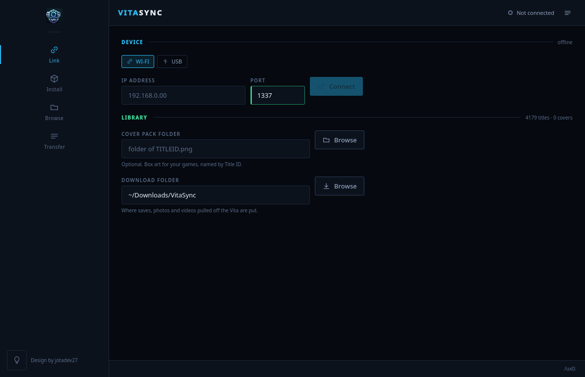
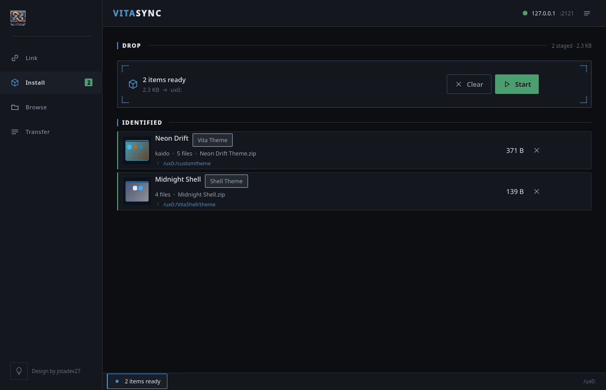
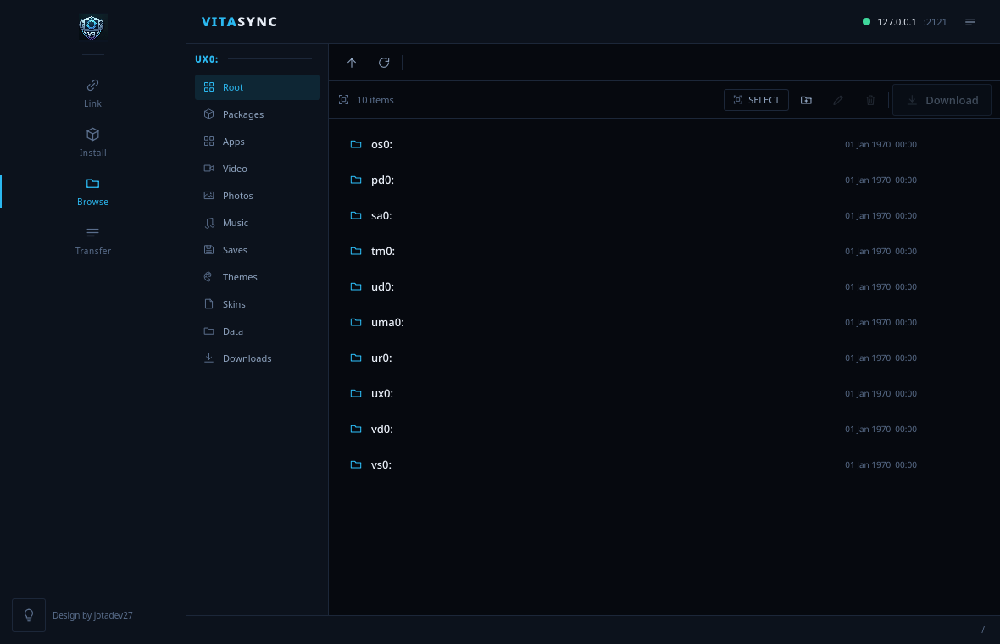
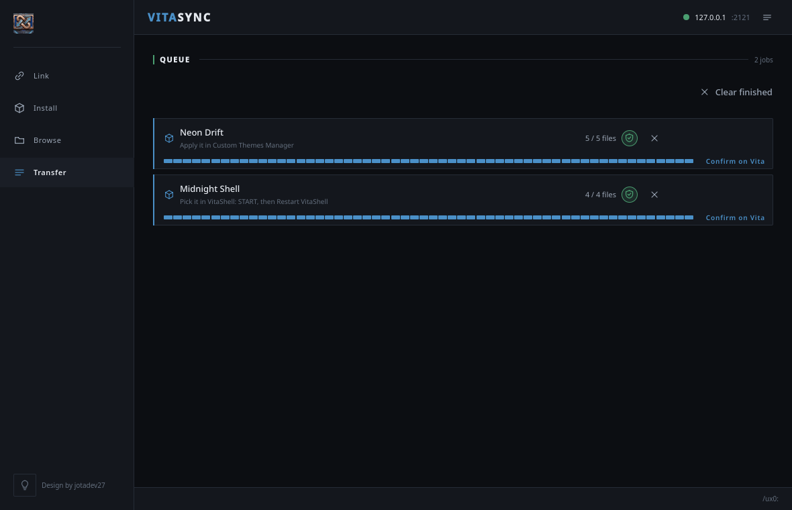

# VitaSync

**v1.0 — first stable release.**

A companion app for a jailbroken/enso'd PS Vita, over Wi-Fi or USB. Connect,
then install games, transfer media, browse the console's storage, pull
saves/photos/videos back to your PC, and install themes — no account, no
cloud, no internet connection required for anything the app does.



---

## What you need

- A PS Vita running **[VitaShell](https://github.com/TheOfficialFloW/VitaShell)**
  (any jailbroken/enso'd Vita has this). VitaShell is what exposes both
  connection modes this app uses — there is nothing else to install on the
  console.
- Either the Vita and your PC on the **same Wi-Fi network**, or a **USB
  cable** connecting the two.

---

## Connecting

VitaSync supports two connection modes. Pick one per session — they
are alternatives, not simultaneous, the same way VitaShell itself only runs
one at a time.

### Wi-Fi (FTP)

1. On the Vita, open VitaShell and press **SELECT**. This starts VitaShell's
   built-in FTP server and shows an IP address and a port on screen.
2. In VitaSync's **Link** screen, choose the **WI-FI** mode, type that
   IP address and port in, and press **Connect**.
3. Once connected, the panel below shows what the device reported (mount
   points it exposes) so you can visually confirm you're talking to your
   own console.

Recent IP:port pairs you've connected to are remembered under **RECENT** for
one-tap reconnecting; a **Clean** action appears once that list gets long.

> [Screenshot: Link screen connected via Wi-Fi, device panel visible]

### USB

1. Connect the Vita to your PC with a USB cable.
2. On the Vita, from VitaShell's Start menu, pick **USB** (the same panel
   that offers FTP). The console shows a "USB Connected" screen; while this
   is active, Wi-Fi/FTP is not reachable — the two modes are exclusive on
   the console side, not just in this app.
3. In VitaSync's **Link** screen, choose the **USB** mode and press
   **Scan**. The app looks for a mounted volume carrying both a Vita-written
   `id.dat` and a VitaShell install folder, which is specific enough to tell
   your Vita's memory card apart from an unrelated USB drive.
4. Pick the detected volume (or point the app at it manually if the scan
   doesn't find it) and press **Connect**.

USB mode targets the default **Memory Card** export only. Game Card, SD2Vita
or PSVSD USB modes on the console export a different partition layout and
are not supported.

> [Screenshot: Link screen connected via USB, detected volume chip selected]

---

## What it does

### Installing games

Drag one of the following onto the **Install** screen:

- **A `.vpk` file** — the app reads the Title ID and exact name straight out
  of the package (`param.sfo`), looks up cover art in the offline title
  database, and shows both before you press Start. There is no
  remote-install command on a jailbroken Vita, so after uploading and
  verifying the transfer, the app tells you the one step left: **press X on
  the file in VitaShell.**
- **An unpacked game folder** (named by the game's serial, e.g.
  `PCSE00001/`) — sent whole to the console in its installed shape. No
  install step exists for this one; the app tells you to use **Refresh
  LiveArea** in VitaShell instead, which is what makes the console notice it.
- **A NoNpDrm-style dump** — a folder containing `app/`, `addcont/`, and/or
  `license/` subfolders, each holding one or more serial-named game folders.
  Each part is recognized and routed to its own correct destination on the
  console (app data, add-on content, and license data each land in a
  different place); a drop with two parts shows two separate staged rows so
  you can see exactly what's going where before pressing Start.

`.pkg` files are not supported — folder-format and `.vpk` only.

> [Screenshot: Install screen with a staged VPK, cover art and destination visible]

### Transferring media

Drag video, photo, or music files onto **Install** and the app routes them
to the correct folder on the console automatically — no manual path picking
for the common case, with manual override available if you want one.

### Installing themes

There are two different things called a "theme" on a jailbroken Vita, and
this app tells them apart automatically:

- **A PS Vita home-screen theme** (a folder with `theme.xml` at its root) —
  installed to the console's custom-theme folder, and applied afterward with
  **Custom Themes Manager** on the device.
- **A VitaShell skin** (a folder of `colors.txt` and/or VitaShell's
  documented image set) — installed to VitaShell's own theme folder, and
  picked from inside **VitaShell itself** (press START, then left/right to
  choose it, then Restart VitaShell).

Drag either kind onto **Install** the same way as a game — the app shows the
theme's real name and its own preview art before you press Start, and tells
you which tool to use to finish once the transfer is done. The app never
switches your active skin for you; that choice stays yours.



### Browsing the console

The **Browse** screen is a full remote file manager: navigate folders,
rename, delete, move, and create folders, on either connection mode. Root
shows every partition the console has (`ux0:`, `ur0:`, and so on), not just
one. Multi-select works by click/ctrl-click/shift-click or by drag-select
(a rubber-band box on desktop; press-and-hold to start a selection on
touch), and drag & drop works both within the remote tree and between the
remote tree and your PC's own file explorer.



### Downloading from the console

Also from **Browse**, navigate to the console's photo, video, or savedata
locations, select what you want (single files or whole folders, drag-select
included), and download to a folder you choose on your PC. Folders come
back whole, subfolders and all.



---

## Building from source

### Desktop (Linux / Windows)

```bash
cmake -S . -B build -G Ninja -DCMAKE_BUILD_TYPE=Release
cmake --build build
./build/desktop/vitasync
```

Needs Qt 6.5+ (Core, Network, Concurrent, Quick, QuickControls2) and zlib.
Qt Multimedia is optional — without it, video previews fall back to a drawn
plate instead of a decoded frame.

Useful command-line flags:

```bash
vitasync game.vpk theme.zip                            # stage files on start
vitasync --connect 192.168.0.40                        # connect without typing the address
vitasync --connect 192.168.0.40:1337 --send game.vpk   # scripted install
vitasync --log                                         # mirror the protocol trace to stderr
vitasync --view browse                                 # start on a given screen
vitasync --connect 192.168.0.40 --path /ux0:/video     # open a folder directly
vitasync --screenshot out.png --screenshot-delay 800    # render one frame and exit
```

### Android

Wired but not yet built as part of this project — needs a Qt-for-Android
kit, which the development machine used so far did not have installed.

```bash
qt-cmake -S . -B build-android \
    -DCMAKE_TOOLCHAIN_FILE=$ANDROID_NDK_ROOT/build/cmake/android.toolchain.cmake \
    -DANDROID_ABI=arm64-v8a -DQT_ANDROID_ABIS=arm64-v8a
cmake --build build-android --target apk
```

### Tests

```bash
ctest --test-dir build --output-on-failure
```

132 tests across four suites, all against `MockVitaServer` — an in-process
stand-in for VitaShell's FTP server that deliberately reproduces its real
quirks and fallback behavior, not just the FTP spec, plus a USB transport
test double for the Mass Storage path:

- **`tst_core`** — path hygiene, SFO/ZIP parsing, package and theme
  identification, archive extraction including zip-slip refusal.
- **`tst_transport`** — the real FTP client against the mock server:
  uploads, downloads, verification, the size-mismatch failure path, theme
  folder installs, recursive folder downloads, and the navigation protocol.
- **`tst_usb`** — the USB transport against a mounted-folder test double:
  copy, mkdir, cancel, mount-loss detection, and the async request/reply
  contract it shares with the FTP client.
- **`tst_device`** — `VitaDevice`, the object the UI binds to, driven the
  way the UI drives it: drop, route, send, browse, download, refuse, across
  both connection modes.

### A portable build to hand to a tester

```bash
tools/make_portable_linux.sh
```

Produces a self-contained folder with the binary, the Qt libraries and QML
modules it needs, and the offline title database — extract and run, nothing
installed. Low-level system libraries (glibc, libstdc++, the graphics
stack) are deliberately not bundled, since those have to match the host.

### Driving the app without a Vita

The mock server used by the test suite is also a runnable binary, so every
feature can be exercised end to end on one machine:

```bash
./build/core/tests/mockvita --port 2121 /path/to/fake-card
./build/desktop/vitasync --connect 127.0.0.1:2121 --log

# and to watch verification fail on purpose:
./build/core/tests/mockvita --port 2121 --corrupt-size /path/to/fake-card
```

---

## Security & privacy

- **No internet required, ever.** The only connections the app opens are to
  the Wi-Fi address you type or the USB volume you select — nothing else.
  No telemetry, no analytics, no update-check pinging, no phone-home.
- **No OS username shown anywhere in the UI.** Local folder paths display
  with your home directory collapsed to `~`; the real path is used for the
  actual file operations, it's just never printed to the screen.
- **Input validation** on the IP field and on any manually entered path — no
  shell or file command is ever built by concatenating user input.
- **Filename sanitization** against path traversal in both directions
  (Vita → PC and PC → Vita), and specifically against zip-slip when
  unpacking a theme archive, the one place archive contents are ever
  written to local disk.
- **Integrity checking** on package uploads: a SHA-256 is computed locally
  before upload and compared against the device-reported file size
  afterward — the strongest end-to-end check FTP actually allows, and the
  app is explicit in its own UI about which of the two checks it performed.
- **No plaintext credentials.** VitaShell's FTP server is anonymous by
  default; nothing beyond that is stored.

---

## Known limits

- No `.apk` has been built or run yet — see the Android section above.
- One transfer at a time, deliberately: both the Vita's FTP server and a
  Mass Storage volume are effectively single-connection, and racing either
  only produces errors.
- The active VitaShell skin is not switched for you — copying a skin in
  doesn't rewrite VitaShell's selection file; picking which one is live
  stays your call.
- USB mode targets the default Memory Card export only (see Connecting,
  above).

---

## Project layout

```
core/vsp/       shared C++ core: RemoteTransport (interface), FtpClient,
                UsbTransport, ZipReader, SfoReader, PackageInspector,
                ThemeReader, ArchiveExtractor, RemoteTreeScanner,
                TransferQueue, MetadataDb, VitaPaths, PathUtils, VitaDevice
core/tests/     unit tests, an in-process mock of VitaShell's FTP server,
                and mockvita -- the same mock as a runnable binary
media/          Thumbnailer -- photo, video-frame and theme previews
desktop/qml/    Theme (design tokens), components/, views/
android/        manifest, theme, launcher icons (unbuilt)
assets/covers/  titles.json -- the offline title index (4,179 titles)
assets/logo/    app icon cut from the project's brand sheet
tools/          build_titles.py -- regenerates the title index
                make_portable_linux.sh -- builds a self-contained bundle
                install_linux.sh -- per-user install of that bundle
docs/           install-trigger.md, themes.md, browsing.md, usb.md,
                nonpdrm.md, architecture.md -- researched, not assumed,
                write-ups of how the console side of each feature works
```

---

## Credits

Design by jotadev27.
